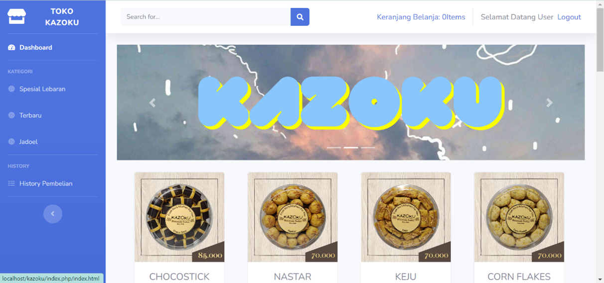
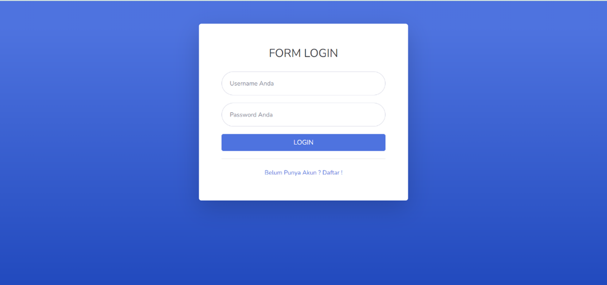
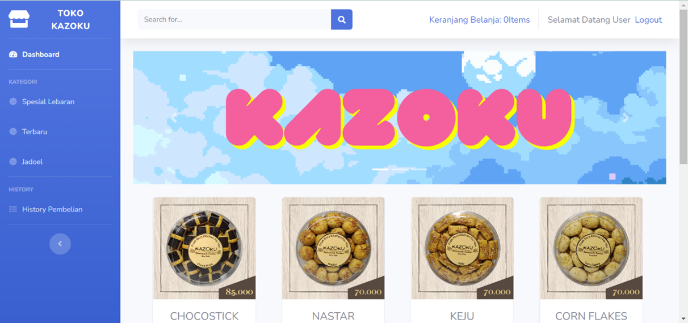
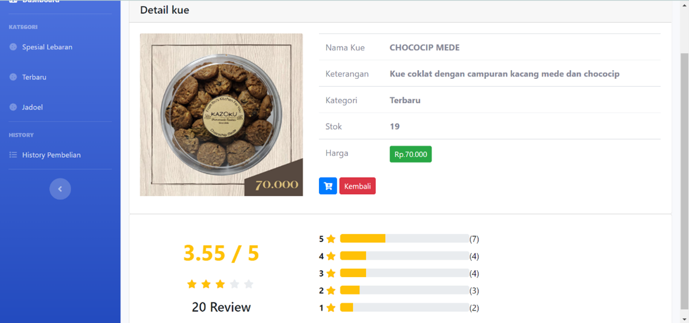
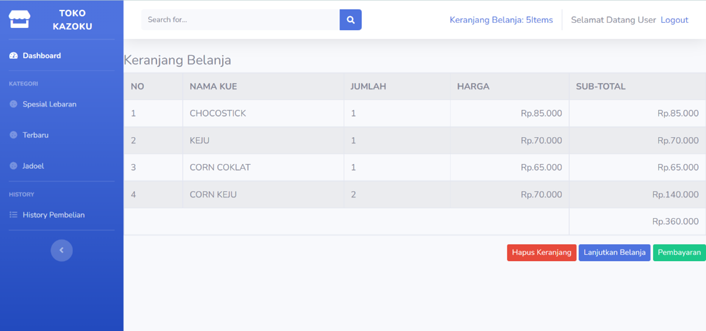

# Kazoku Cake Marketplace 🎂

Kazoku Cake Marketplace adalah aplikasi website untuk pemesanan kue kering yang dilengkapi dengan sistem rekomendasi menggunakan metode Collaborative Filtering.

## 📌 Fitur Utama
- Pemesanan kue kering secara online
- Manajemen produk dan kategori
- Sistem rekomendasi produk (Collaborative Filtering)
- User login & register
- Keranjang belanja (cart)

## 🧠 Metode yang Digunakan
- Collaborative Filtering untuk memberikan rekomendasi produk berdasarkan preferensi user

## 🛠️ Teknologi
- HTML, CSS, JavaScript
- MySQL

## 🎯 Tujuan
Membantu pengguna dalam menemukan dan memesan kue kering dengan lebih mudah serta mendapatkan rekomendasi produk yang sesuai.

## 📷 Screenshot

## 👤 Author
- Haniitrs
